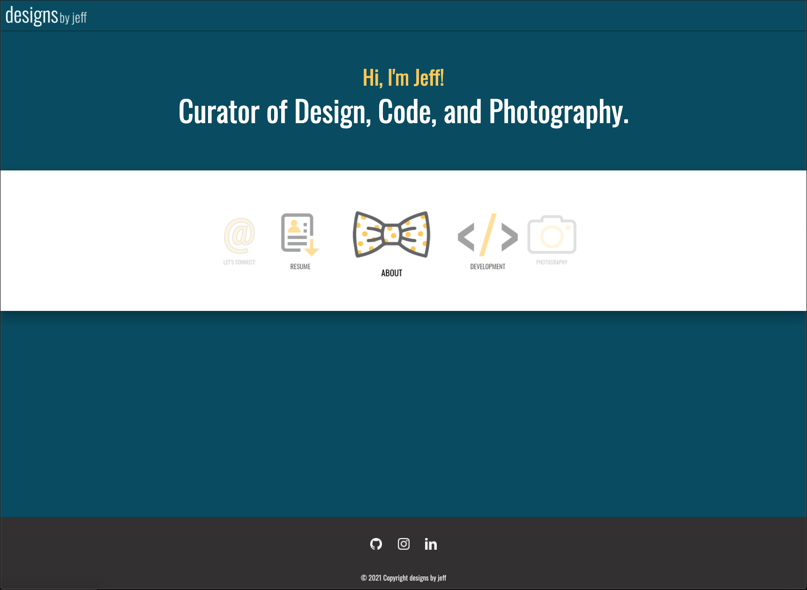

# 08-Project-1-Professional-Materials

The goal was to build a personl portfolio website that will allow you to showcase your work. I hope you enjoy!

## GitHub Links

Live Page [Link](https://jeffcela.github.io/08-Project-1-Professional-Materials/)  
Project Repository [Link](https://github.com/jeffcela/08-Project-1-Professional-Materials)

## How its made!

Make sure to clone or download the entire repository as this document uses **HTML, CSS, and JavaScript files**. If you add in any additional features, please comment where you added them to make it easier for other developers to follow, you will see that comments have been left for future upgrades or tinkering. Please note that this website is built with several different html, css, and js files to allow for you to plug and play pages and features.

**What is included:**

- index.html
- gitignore (Used to prevent items from being added to the repo)
- assets folder
  - images
  - css folder
    - style.css
    - style-dev.css
    - style-photo.css
    - style-contact.css
    - style-about.css
  - js folder
    - script.js
    - character_count.js
    - gallery.js
    - carousel.js
- README.md

_Please make sure that you are adding any additional assets as needed_

## This is what the updated Porfolio looks like!

# Credit 

_This homework assignment was completed in VS Code and Terminal by [Jeff Cela](https://www.linkedin.com/in/jeffcela/) on the day of 08/06/2021_

© 2021 Trilogy Education Services, LLC, a 2U, Inc. brand. Confidential and Proprietary. All Rights Reserved.

_HTML._ W3Schools Online Web Tutorials. (1999). [https://www.w3schools.com/](https://www.w3schools.com/).

Materialize. (n.d.). https://materializecss.com/.
